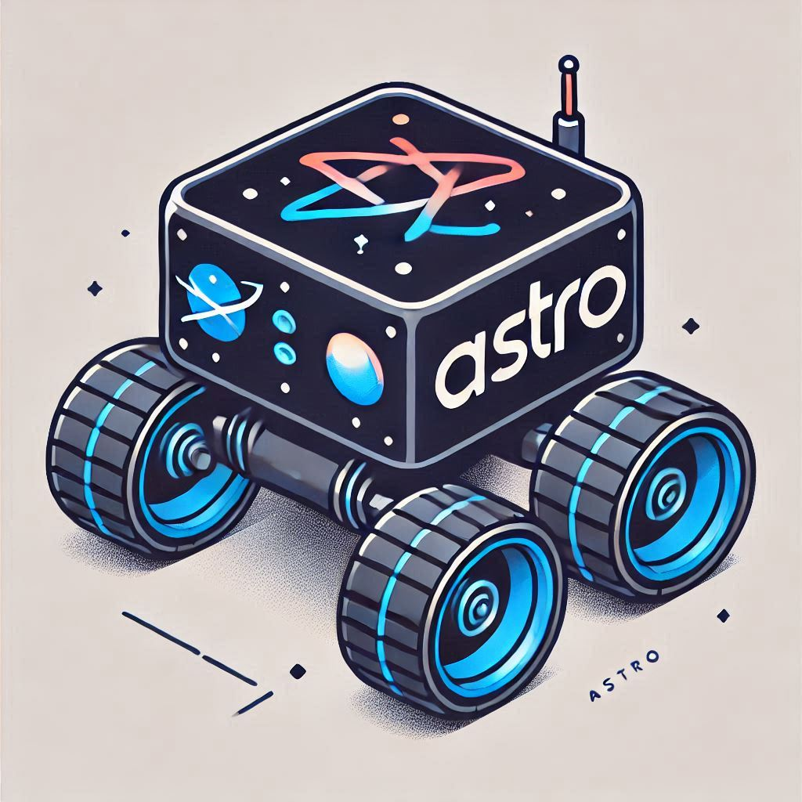
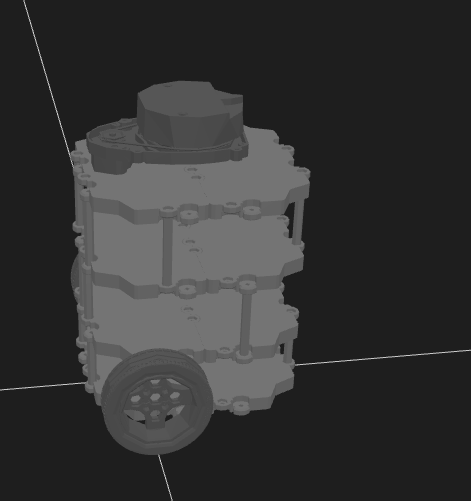
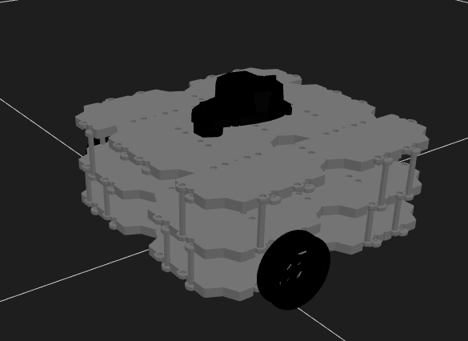

# Astro ( A Turtlebot3 based ROS Robot )
Branch: main [](https://github.com/furhadjidda/astro/actions/workflows/main.yml) [](https://github.com/furhadjidda/astro/actions/workflows/ros2.yml)[](https://github.com/furhadjidda/astro/actions/workflows/zephyr.yml)

Branch: feature/slam [](https://github.com/furhadjidda/astro/actions/workflows/main.yml) [](https://github.com/furhadjidda/astro/actions/workflows/ros2.yml)

<div style="border: 2px solid orange ; padding: 10px; color: orange; font-weight: bold;">
⚠️ **Warning** : This is a work in progress and there will be frequent updates to this repository.
</div>


  


## System Configuration

<table>
    <tr>
        <th style="background-color:rgb(247, 173, 15); padding: 10px; color: black;">Version of ROS used</th>
        <td style="background-color:rgb(64, 131, 233); padding: 10px; color: black;">ROS Humble</td>
    </tr>
    <tr>
        <th style="background-color:rgb(247, 173, 15); padding: 10px; color: black;">Version of OS on host and target</th>
        <td style="background-color:rgb(64, 131, 233); padding: 10px; color: black;">Ubuntu 22.04</td>
    </tr>
</table>

### Sensors

<table>
    <tr>
        <th style="background-color:rgb(212, 159, 210); padding: 10px; color: black;"><strong>IMU</strong></th>
        <td style="background-color:rgb(8, 30, 61); padding: 10px; color: black;"><a href="https://cdn-learn.adafruit.com/assets/assets/000/125/776/original/bst-bno055-ds000.pdf?1698865246">BNO055</a></td>
    </tr>
    <tr>
        <th style="background-color:rgb(212, 159, 210); padding: 10px; color: black;"><strong>Lidar</strong></th>
        <td style="background-color:rgb(8, 30, 61); padding: 10px; color: black;"><a href="https://bucket-download.slamtec.com/d1e428e7efbdcd65a8ea111061794fb8d4ccd3a0/LD108_SLAMTEC_rplidar_datasheet_A1M8_v3.0_en.pdf">RPLIDAR A1M8</a></td>
    </tr>
    <tr>
        <th style="background-color:rgb(212, 159, 210); padding: 10px; color: black;"><strong>Lidar</strong></th>
        <td style="background-color:rgb(8, 30, 61); padding: 10px; color: black;"><a href="https://openzeka.com/wp-content/uploads/2024/02/SLAMTEC_rplidarkit_usermanual_C1_v1.0_en.pdf?srsltid=AfmBOopQ0e0YG65J9YMMvJnuaTrmSK2NHstQl0l8d0ITCdm3V0HowmfH">RPLIDAR C1</a></td>
    </tr>
    <tr>
        <th style="background-color:rgb(212, 159, 210); padding: 10px; color: black;"><strong>Microcontroler</strong></th>
        <td style="background-color:rgb(8, 30, 61); padding: 10px; color: black;"><a href="https://datasheets.raspberrypi.com/pico/pico-datasheet.pdf">Raspberry pi pico</a></td>
    </tr>
    <tr>
        <th style="background-color:rgb(212, 159, 210); padding: 10px; color: black;"><strong>Time of Flight Sensor</strong></th>
        <td style="background-color:rgb(8, 30, 61); padding: 10px; color: black;"><a href="https://www.adafruit.com/product/3317">VL53L0X</a></td>
    </tr>
    <tr>
        <th style="background-color:rgb(212, 159, 210); padding: 10px; color: black;"><strong>RGB Depth Camera with 6 DOF IMU</strong></th>
        <td style="background-color:rgb(8, 30, 61); padding: 10px; color: black;"><a href="https://www.intelrealsense.com/download/21345/?tmstv=1697035582">Intel realsense D455</a></td>
    </tr>
    <tr>
        <th style="background-color:rgb(212, 159, 210); padding: 10px; color: black;"><strong>AI Depth Camera by Luxonis</strong></th>
        <td style="background-color:rgb(8, 30, 61); padding: 10px; color: black;"><a href="https://docs.luxonis.com/hardware/products/OAK-D%20Lite">OAK-D Lite</a></td>
    </tr>
</table>

### Odomtery

#### DC Motors with Encoder
<table>
    <tr>
        <th style="background-color:rgb(235, 177, 111); padding: 10px; color: black;"><strong>DC Motor with encoder</strong></th>
        <td style="background-color:rgb(163, 186, 219); padding: 10px; color: black;">Encoder Metal Gearmotor 12V DC Low Speed 60 RPM Gear Motor</td>
    </tr>
    <tr>
        <th style="background-color:rgb(235, 177, 111); padding: 10px; color: black;"><strong>Motor Controller</strong></th>
        <td style="background-color:rgb(163, 186, 219); padding: 10px; color: black;">Waveshare DC Motor Driver for raspberry pi pico</td>
    </tr>
    <tr>
        <th style="background-color:rgb(235, 177, 111); padding: 10px; color: black;"><strong>Wheels</strong></th>
        <td style="background-color:rgb(163, 186, 219); padding: 10px; color: black;">4 Pieces RC 1:16 Paddles Buggy Tires Hex 12mm Wheels </td>
    </tr>
</table>

#### Dynamixel System
<table>
    <tr>
        <th style="background-color:rgb(235, 177, 111); padding: 10px; color: black;"><strong>Servo Motor</strong></th>
        <td style="background-color:rgb(163, 186, 219); padding: 10px; color: black;">DYNAMIXEL XL430-W250-T</td>
    </tr>
    <tr>
        <th style="background-color:rgb(235, 177, 111); padding: 10px; color: black;"><strong>Controller</strong></th>
        <td style="background-color:rgb(163, 186, 219); padding: 10px; color: black;">U2D2 Power Hub Board Set with U2D2</td>
    </tr>
    <tr>
        <th style="background-color:rgb(235, 177, 111); padding: 10px; color: black;"><strong>Wheels</strong></th>
        <td style="background-color:rgb(163, 186, 219); padding: 10px; color: black;">TB3 Wheel Tire Set</td>
    </tr>
</table>

### Turtlebot 3 Styles Working on




## Description
The purpose of this project is to understand ROS2 but also learn about different sensors used in robotics along the way.

## Pre-requisite Installations

| Package       | Instructions                                                         |          |
|---------------|----------------------------------------------------------------------|----------|
| ROS humble    | https://micro.ros.org/docs/tutorials/core/first_application_linux/   | ROS Framework |
| Micro ROS     | https://docs.ros.org/en/humble/Installation/Ubuntu-Install-Debs.html | Needed ROS communication between Raspberry pi pico and Raspberry pi 4 |


## Other Modules used
<div style="border: 2px solid green ; padding: 10px; color: green; font-weight: bold;">
⚠️ **Note** : These are already added to the astro.repos so no need to clone and install them separately.
This will get build when you build the project.
</div>

| Sensor Package| Package Link                                                 |   Sensor Model          |
|---------------|--------------------------------------------------------------|-------------------------|
| RPI Lidar     | https://github.com/Slamtec/rplidar_ros/tree/ros2             |  RPLIDAR A1M8/C1        |
| Realsense     | https://github.com/IntelRealSense/realsense-ros              |  Realsense D455         |
| Dynamixel     | https://github.com/ROBOTIS-GIT/DynamixelSDK                  |  DYNAMIXEL XL430-W250-T |


## Build and Launch
* Clone git@github.com:furhadjidda/astro.git
* Navigate to ros2_rpi_ws
* Clone the needed repos using `vcs import .  < astro.repos`
* execute `colcon build`
* execute `source install\setup.bash`
<div style="border: 3px solid orange ; padding: 11px; color: purple; font-weight: bold;">
⚠️ **Note** : Without launching robot_bringup nothing else will work as all sensors and servos are brought up here

⚠️ **Note** : Please also make sure to update the udev rules 99-custom.rules to add the correct ATTRS{serial}=="E6614103E77F3A36"
   that macthes your device. you can find out that by using this command
   ` udevadm info --name=<device> --attribute-walk | grep -i "ATTRS{serial}" `
</div>

* execute `ros2 launch robot_bringup robot_base.launch.py enable_realsense:=false enable_lidar:=true enable_microros:=true enable_dynamixel:=false microros_dev:=<device_name>`
    * enable_realsense(true/false) - enables or disables  the realsense camera
    * enable_lidar(true/false) - enables or disableslidar
    * enable_dynamixel(true/false) - enables or disables the dynamixel code to run the XL430 servos which moves the robot
    * enable_microros(true/false) - enables or disables microros which enables communication with pico connected to sensors
    * device_name can be either one of the below
        * /dev/pimoroni_pico_2W
        * /dev/pimoroni_pico_inventor
        * /dev/raspberry_pico
* now you can launch any other node you want
    * cartography - `ros2 launch astro_cartographer cartographer.launch.py`
    * Autonomous driving - @todo


# Raspberry pi configurations and access

## Configuring host and target machines
I want to be able to see all the nodes my raspberry pi has on it and vice versa. This way I can potentially offload CPU intensive operations on the host machine like SLAM and 3D mapping. for me to be able to do that I added these lines in the ~/.bashrc file.

```
# Set the same domain ID for all devices
export ROS_DOMAIN_ID=10

# Choose a common DDS implementation (e.g., CycloneDDS or FastDDS)
export RMW_IMPLEMENTATION=rmw_fastrtps_cpp

```

to test if this is working or not you can run one of these node on a raspberry pi and one on desktop pc.

```
ros2 run demo_nodes_cpp talker

ros2 run demo_nodes_cpp listener
```

NOTE: Make sure that both the raspberry pi and the desktop PC are on the same network.

NOTE: After making the changes in the ~/.bashrc file please make sure that the node is also setting the domain id as 10, otherwise you will not see any topics using `ros2 topic echo <topic_name>`.
so basically make sure that the if your environment has domain id as 10 the nodes you are trying to list or echo also has the same domain id.


## Accessing Raspberry pi via VNC Server
These are commands you will need to run everytime you need to access raspberry pi through VNC

`vncserver :1 -localhost no -geometry 1920x1080`

From the host side you will need to use this in place of the ip address

`<ip-address>:1`


# Pico Firmware
## How to compile and install pico firmware
### host build( for running tests )
1. After cloning the astro repo make sure to run `git submodule update --init --recursive`.
2. Configure cmake `cmake -S . -B host_build/ -DBUILD_FOR_HOST=ON`.
3. Build the firmware `cmake --build host_build`.
4. You can now run tests

### target build( Firmware image)
1. After cloning the astro repo make sure to run `git submodule update --init --recursive`.
2. Configure cmake `cmake -S . -B target_build/`.
3. Build the firmware
    1. To build for pico_w use
    ```
    cmake -S . -B build_pico_w -DPICO_BOARD=pico_w -DMCU_TYPE=cortex-m0
    cmake --build build_pico_w
    ```
    2. To build for pico2_w use
    ```
    cmake -S . -B build_pico2_w -DPICO_BOARD=pico2_w -DPICO_PLATFORM=rp2350 -DMCU_TYPE=cortex-m33
    cmake --build build_pico2_w

    ```
4. Connect your device so it’s ready for file transfer.


## Other Imporatant Commands when needed
### Static transformations
#### For Odomtery
ros2 run tf2_ros static_transform_publisher 0 0 0 0 0 0 1 odom base_link
#### For IMU
ros2 run tf2_ros static_transform_publisher 0 0 0 0 0 0 map imu_frame

### Launching Lidar
ros2 launch sllidar_ros2 view_sllidar_a1_launch.py scan_mode:=Standard

# Gratitude and References:
* A big thanks to Matthieu M  whose work on Fox bot not only helped me building my odometry but with his 3D printed stl files and ideas he presented in his project helped out a lot.
  * His project page - https://www.instructables.com/Build-Your-Own-Turtblebot-Robot/ and https://hackaday.io/project/167074-build-your-own-turtlebot-3-backbone
* https://www.thegeekpub.com/16265/using-xbox-one-controllers-on-a-raspberry-pi/
* https://mjwhite8119.github.io/Robots/twr-model-part1
* https://hackaday.io/project/167074-build-your-own-turtlebot-3-backbone/log/166955-motor-speed-control


## Nodes
<table>
    <tr>
        <th style="background-color:rgb(235, 201, 129); padding: 20px; color: black;font-size: 18px;">Node Name</th>
        <th style="background-color:rgb(235, 201, 129); padding: 20px; color: black;font-size: 18px;">Description</th>
    </tr>
    <tr>
        <td style="background-color:rgb(161, 161, 159); padding: 10px; color: black;font-size: 16px;">robot_base.launch</td>
        <td style="background-color:rgb(161, 161, 159); padding: 10px; color: black;font-size: 16px;">
            This launches core nodes of the robot. Below are the nodes this package launches.
            <ul>
                <li>micro_ros_agent</li>
                <li>astro_odometry_tf_broadcaster</li>
                <li>static_transform_publisher</li>
                    <ul>
                        <li>baselink -> base_footprint</li>
                        <li>baselink -> imu_link</li>
                        <li>baselink -> laser</li>
                        <li>baselink -> camera_link</li>
                    </ul>
                <li>sllidar_ros2</li>
                <li>robot_state_publisher</li>
                <li>realsense2_camera</li>
                <li>ros_time</li>
                <li>astro_sensor</li>
                <li>astro_dynamixel_odometry</li>
            </ul>
        </td>
    </tr>
    <tr>
        <td style="background-color:rgb(161, 161, 159); padding: 10px; color: black;font-size: 16px;">ros_time</td>
        <td style="background-color:rgb(161, 161, 159); padding: 10px; color: black;font-size: 16px;">Publishes time for synchronization</td>
    </tr>
    <tr>
        <td style="background-color:rgb(161, 161, 159); padding: 10px; color: black;font-size: 16px;">astro_sensor</td>
        <td style="background-color:rgb(161, 161, 159); padding: 10px; color: black;font-size: 16px;">Synchronizes imu , odom and gnss messages with time provided by ros_time</td>
    </tr>
    <tr>
        <td style="background-color:rgb(161, 161, 159); padding: 10px; color: black;font-size: 16px;">astro_robot_description</td>
        <td style="background-color:rgb(161, 161, 159); padding: 10px; color: black;font-size: 16px;">Publishes description for the robot to be able to see the model on rviz2</td>
    </tr>
    <tr>
        <td style="background-color:rgb(161, 161, 159); padding: 10px; color: black;font-size: 16px;">astro_dynamixel_odometry</td>
        <td style="background-color:rgb(161, 161, 159); padding: 10px; color: black;font-size: 16px;">Publishes odometry for the robot</td>
    </tr>
    <tr>
        <td style="background-color:rgb(161, 161, 159); padding: 10px; color: black;font-size: 16px;">astro_slam</td>
        <td style="background-color:rgb(161, 161, 159); padding: 10px; color: black;font-size: 16px;">Publishes nodes for SLAM</td>
    </tr>
    <tr>
        <td style="background-color:rgb(161, 161, 159); padding: 10px; color: black;font-size: 16px;">astro_teleop_twist_joy</td>
        <td style="background-color:rgb(161, 161, 159); padding: 10px; color: black;font-size: 16px;">Publishes nodes to control the robot through terminal</td>
    </tr>
</table>
