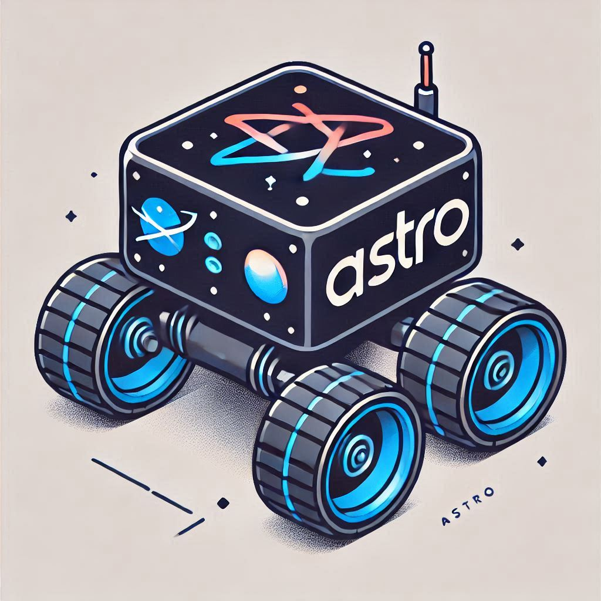
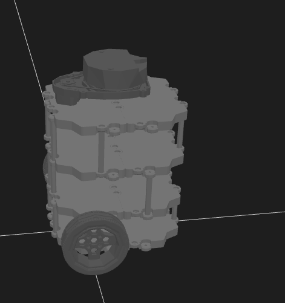
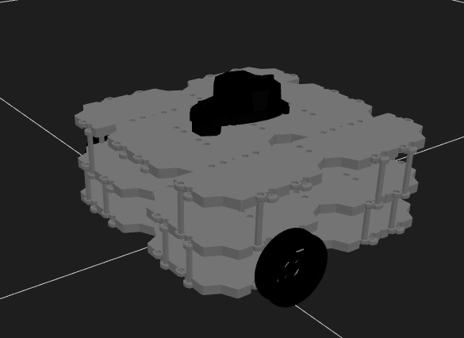

# Astro — A TurtleBot3-Based ROS 2 Robot

[](https://github.com/furhadjidda/astro/actions/workflows/main.yml)
[](https://github.com/furhadjidda/astro/actions/workflows/ros2.yml)
[](https://github.com/furhadjidda/astro/actions/workflows/zephyr.yml)

> **Warning** — This is a work in progress with frequent updates.



Astro is a differential-drive robot built on the TurtleBot3 platform, powered by a **Raspberry Pi 4** running **ROS 2 Humble**. Low-level sensor I/O and motor control run on microcontrollers (Raspberry Pi Pico or Zephyr-based boards) communicating via **micro-ROS**.

## Documentation

| Document | Description |
|----------|-------------|
| [Architecture](architecture.md) | System diagram, data flow, TF tree, and build targets |
| [micro-ROS Node Deep Dive](microros-node-deep-dive.md) | app_microros_node component/deployment/class/sequence/activity diagrams + Wi-Fi and synchronization notes |
| [ROS 2 Packages](ros2-packages.md) | All ROS 2 nodes, launch instructions, and cross-compile guide |
| [Pico Firmware](pico-firmware.md) | Pico node descriptions, build commands, and driver library docs |
| [Zephyr Firmware](zephyr-firmware.md) | Zephyr app builds, supported boards, and debugging |
| [Hardware Setup](hardware-setup.md) | udev rules, device symlinks, VNC access, and useful commands |

## System Overview

| Layer | Hardware | Software |
|-------|----------|----------|
| **Compute** | Raspberry Pi 4 (4 GB) | Ubuntu 22.04, ROS 2 Humble |
| **Microcontroller** | Pico W / Pico 2W / ESP32-S3 (RAK, Adafruit) | FreeRTOS or Zephyr RTOS + micro-ROS |
| **Lidar** | RPLidar A1M8 or C1 | `sllidar_ros2` |
| **Depth Camera** | Intel RealSense D455 | `realsense2_camera` |
| **AI Camera** | OAK-D Lite | `depthai-ros` |
| **IMU** | BNO055 (Pico) / IIM-42652 (Zephyr) | micro-ROS sensor node |
| **GNSS** | PA1010D (MTK3333) | micro-ROS GNSS node |
| **ToF Sensor** | VL53L0X | micro-ROS sensor node |
| **Drive (DC)** | 12V 60RPM gearmotor + Waveshare driver | `pico_differential_drive_node` |
| **Drive (Servo)** | DYNAMIXEL XL430-W250-T + U2D2 | `astro_dynamixel_odometry` |

### Robot Configurations

| Burger (DC Motors) | Waffle (Dynamixel) |
|---|---|
|  |  |

## Getting Started

### 1. Clone and initialize
```bash
git clone git@github.com:furhadjidda/astro.git
cd astro
git submodule update --init --recursive
```

### 2. Build ROS 2 packages
```bash
cd ros2
vcs import . < astro.repos
source /opt/ros/humble/setup.bash
rosdep install --from-paths src --ignore-src -r -y
colcon build
source install/setup.bash
```

### 3. Build Pico firmware
```bash
cd firmware/pico
cmake -S . -B build_pico2_w -DPICO_BOARD=pico2_w -DPICO_PLATFORM=rp2350 -DMCU_TYPE=cortex-m33
cmake --build build_pico2_w
```

### 4. Launch the robot
```bash
ros2 launch robot_bringup robot_base.launch.py \
    enable_lidar:=true \
    enable_microros:=true \
    microros_dev:=/dev/pimoroni_pico_2W
```

## Acknowledgments

- [Matthieu M / Fox Bot](https://www.instructables.com/Build-Your-Own-Turtblebot-Robot/) — Odometry design & 3D-printed parts
- [Build Your Own TurtleBot 3 Backbone](https://hackaday.io/project/167074-build-your-own-turtlebot-3-backbone)
- [mjwhite8119 — Robots](https://mjwhite8119.github.io/Robots/twr-model-part1)
- [Xbox Controllers on Raspberry Pi](https://www.thegeekpub.com/16265/using-xbox-one-controllers-on-a-raspberry-pi/)
